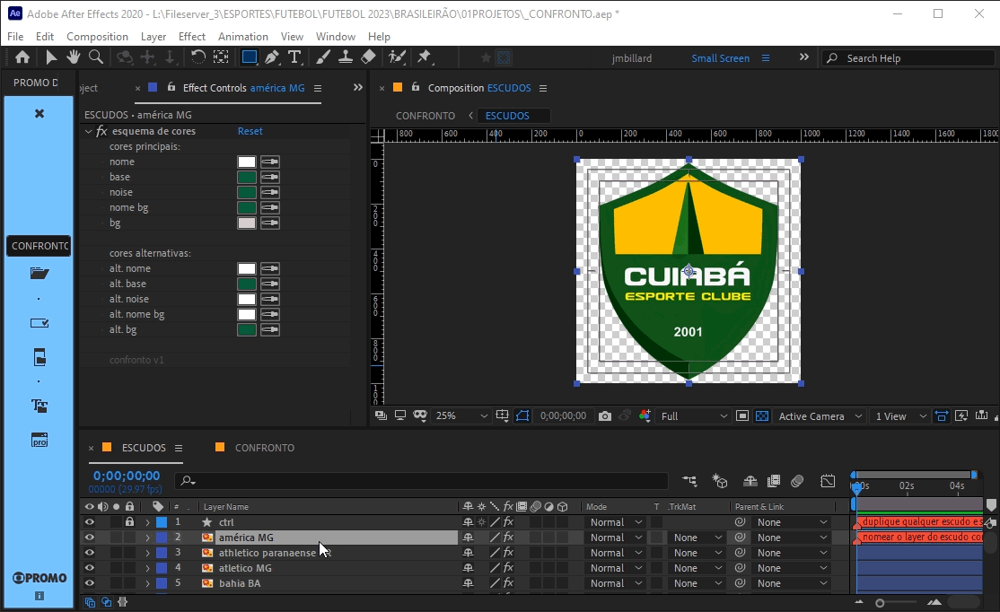
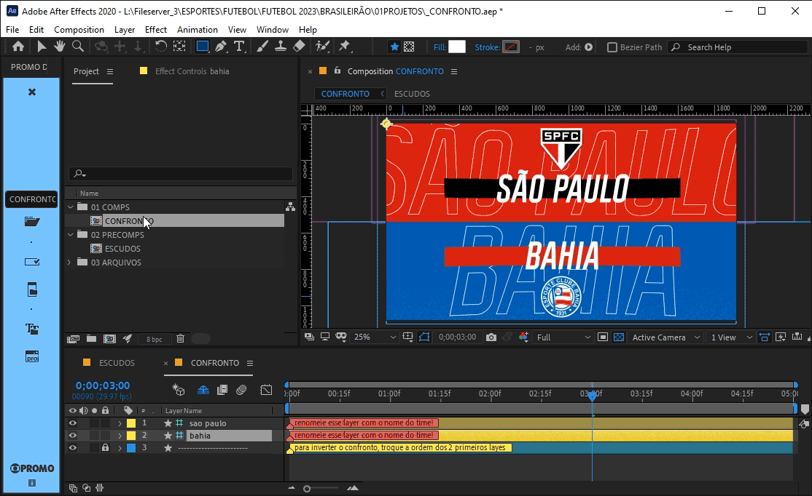

# ⚽ CONFRONTO - BRASILEIRÃO 2023

📂 _L:\Fileserver_3\ESPORTES\FUTEBOL\FUTEBOL 2023\BRASILEIRÃO\01PROJETOS_\
📑 **\_CONFRONTO.aep**

> 📋 _exemplo:_\
> 

---

  

# 📌 funcionamento básico

1. abra a **comp** '_CONFRONTO_'.
2. renomeie os layers 1 e 2 com o nome dos times.
3. use a _janela de controle de efeitos_ para alterar as cores de cada time.
4. adicione ao nome da **comp** '_CONFRONTO_' os nomes dos respectivos times.
   > 📋 _exemplo:_ "_CONFRONTO - FLAMENGO X CORINTHIANS_".

   > 🚩 _obs:_ Sempre use **CAIXA ALTA** sem acentuação e **SEM CARACTERES ESPECIAIS** para nomear **comps**.

---

  

# 🚨 Atenção!

- para adicionar um novo escudo:

  1. abra a **comp** '_ESCUDOS_'.
  2. duplique um **layer** de escudo existente.
  3. substitua o **layer** duplicado pelo novo escudo.
  4. renomeie o **layer** duplicado com o nome do novo time seguido da sigla do estado.
  5. altere os presets de cor do novo time na _janela de controle de efeitos_.
     > 📋 _exemplos de nome do **layer** de escudo:_ "_cuiabá MT_", "_são paulo SP_".

     > 🚩 _obs:_ O nome do **layer** será sempre o nome exibido na **comp** '_CONFRONTO_'.

- para alterar as cores de um escudo existente:
  1. abra a **comp** '_ESCUDOS_'.
  2. selecione o **layer** do escudo desejado.
  3. altere os presets de cor do time na _janela de controle de efeitos_.
     > 📋 _exemplo:_\
     > 

---

  

# 📣 parâmetros

os controles dos times estão nos 2 primeiros **layers** da **comp** '_CONFRONTO_', são eles:

### opções do time

- esquema de cores:

  - principal → cores principais do preset time.
  - alternativo → cores alternativas do preset time.
  - livre → todas as cores do time poderão ser alteradas.

- nome → controla a cor do nome.
- base → controla a cor da base atrás nome.
- noise → controla a cor do ruído do bg.
- nome bg → controla a cor do nome exibido no bg.
- bg → controla a cor do bg.

os controles dos presets de cor estão em cada **layer** da **comp** '_ESCUDOS_', são eles:

### esquema de cores

- cores principais:

  - nome → controla a cor do nome no esquema principal.
  - base → controla a cor da base atrás nome no esquema principal.
  - noise → controla a cor do ruído do bg no esquema principal.
  - nome bg → controla a cor do nome exibido no bg no esquema principal.
  - bg → controla a cor do bg no esquema principal.

- cores alternativas:
  - alt. nome → controla a cor do nome no esquema alternativo.
  - alt. base → controla a cor da base atrás nome no esquema alternativo.
  - alt. noise → controla a cor do ruído do bg no esquema alternativo.
  - alt. nome bg → controla a cor do nome exibido no bg no esquema alternativo.
  - alt. bg → controla a cor do bg no esquema alternativo.

---

  

# ✨ dicas

- não é preciso digitar o nome completo dos times na maioria das vezes, caso existam 2 times com o mesmo nome, basta digitar o nome completo incluindo a sigla do estado.

  > 📋 _exemplo:_ "_fla_" x "_flu_", "_fluminense de feira de santana_" x "_fluminense RJ_"

  > 

  > 🚩 _obs:_ Maiúsculas e minúsculas assim como acentos e caracteres especiais são ignorados na busca dos nomes dos times, assim, "_fla_", "_FLA_" e "_fLÁ_" sempre mostrarão o nome do primeiro time que possuir "_FLA_" em seu nome.

  ---

- para inverter a ordem dos times em um confronto basta alterar a ordem dos 2 primeiros **layers** da **com** '_CONFRONTOS_'.

  > 📋 _exemplo:_\
  > 

  ---

- para agilizar a produção de múltiplos confrontos use a função de **renomear comps** na barra de **PROMO v0.3** ou superior.
  > 📋 _exemplo:_\
  > 
