# 📓 TEMPLATES DO GUIA DE MARCA
📑 **guia de marca - template va1.aet**

---

  

# 📍 funcionamento básico

na **comp** '_OVERVIEW_':

1. edite o nome e a data do projeto.
2. adicione as logos e assinaturas nas respectivas comps.
3. altere as cores da paleta.

e em suas respectivas telas:

4. ajuste o arejamento mínimo.
5. ajuste a redução mínima.
6. edite os exemplos de uso incorreto.
7. ajuste o brilho das cores secundárias.
8. selecione as tipografias do logo e auxiliares.
9. adicione os assets de apoio.
10. adicione os kvs.
11. edite a lista de links.

> 🚩 _obs:_
> - habilite / desabilite e reordene as telas para organizar o guia da marca.
> - habilite / desabilite e reordene os controles de cor para montar a paleta principal.
> - o preview das telas é dinâmico, a ordem da paginação e índice serão atualizados automaticamente.

> 🎬 _preview:_\
> 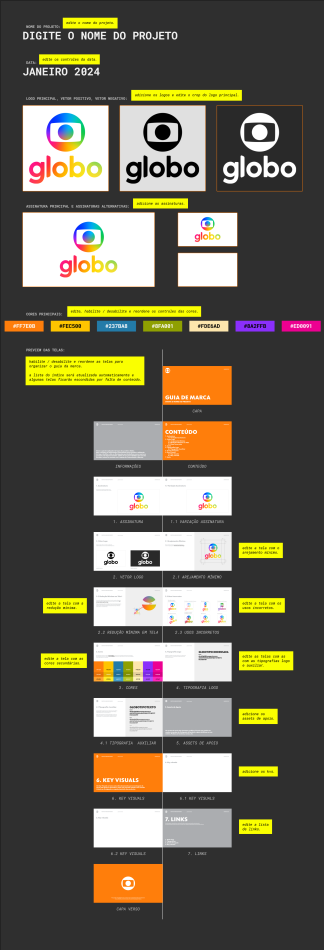

---

  

# 🚨 Atenção!

- a cor principal será sempre a primeira cor da paleta.
- algumas telas só serão exibidas no preview caso tenham algum conteúdo.
- para adicionar uma nova tela:
  1. duplique o layer de uma tela existente.
  2. substitua a tela duplicada pela nova.
  3. reordene o layer da tela para a posição desejada.

---

  

# 📑 Templates de tela disponíveis

- Capa (frente e verso)
- Informações
- Conteúdo
- Assinatura
- Variação Assinatura
- Vetor Logo
- Arejamento Mínimo
- Redução Mínima em Tela
- Usos Incorretos
- Cores
- Tipografia Logo
- Tipografia Auxiliar
- Assets de Apoio
- Key Visuals
- Links

> 🚩 _obs:_
> - alguns templates possuem variação de layout dependendo do conteúdo a ser exibido.

---

  

### 📍 Capa

> 🎬 _preview:_\
> capa frente_\
> 

> _capa verso_\
> 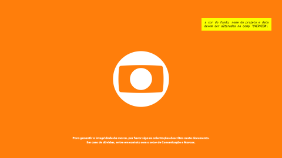

### modo de uso
a cor do fundo é controlada pela primeira cor da paleta na **comp** '_OVERVIEW_'.

> não existem controles nestas telas.

---

  

### 📍 Informações

> 🎬 _preview:_\
> 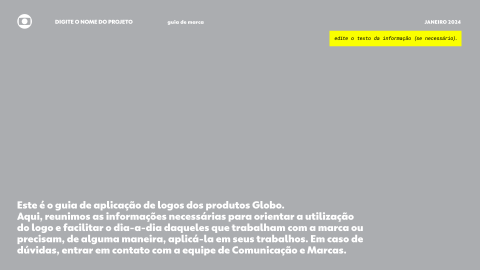

### modo de uso
edite o texto do **layer** '_txt_info_'.

> não existem controles nesta tela.

---

  

### 📍 Conteúdo

> 🎬 _preview:_\
> 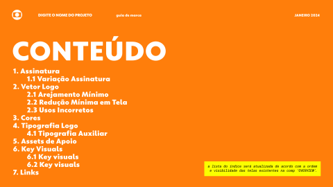

### modo de uso
a lista do índice é controlada pela ordem e visibilidade das telas na **comp** '_OVERVIEW_'.

> não existem controles nesta tela.

---

  

### 📍 Assinatura

> 🎬 _preview:_\
> 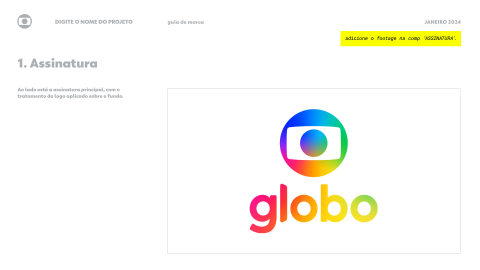

### modo de uso
abra a **comp** '_ASSINATURA_'.\
adicione a imagem da assinatura principal.

retorne para a tela '_Assinatura_'.

> não existem controles nesta tela.

> 🚩 _obs:_
> - o preview desta tela na **comp** '_OVERVIEW_' é desabilitado caso não exista uma imagem na **comp** '_ASSINATURA_'.

---

  

### 📍 Variação Assinatura

> 🎬 _preview:_\
> _1 variação_\
> 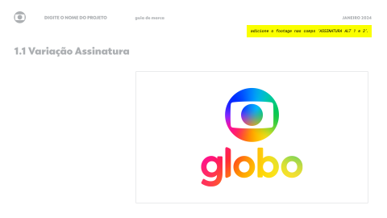

> _2 variações_\
> 

### modo de uso
abra as **comps** '_ASSINATURA ALT 1_' e '_ASSINATURA ALT 2_'.\
adicione as imagens das assinaturas alternativas nas respectivas comps.

retorne para a tela '_Variação Assinatura_'.

> não existem controles nesta tela.

> 🚩 _obs:_
> - o layout também se adaptara ao habilitar / desabilitar os **layers** '_ASSINATURA ALT 1_' e '_ASSINATURA ALT 2_'.\
> - o preview desta tela na **comp** '_OVERVIEW_' é desabilitado caso não exista uma imagem nas **comps** '_ASSINATURA ALT 1_' e '_ASSINATURA ALT 2_'.

---

  

### 📍 Vetor Logo

> 🎬 _preview:_\
> 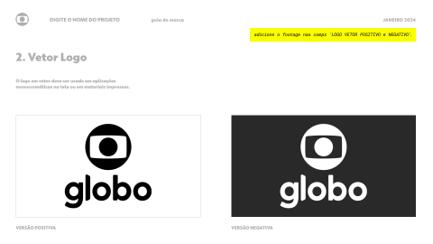

### modo de uso
abra a **comp** '_LOGO_',\
adicione a imagem do logo principal,\
ajuste o seu crop movendo os **layers** '_shp_target S_', '_shp_target E_', '_shp_target D_', '_shp_target I_'.\

retorne para a tela '_Vetor Logo_'.

> não existem controles nesta tela.

> 🚩 _obs:_
> - as versões positiva e negativa são geradas automaticamente quando uma imagem é adicionada na **comp** '_LOGO_',\
> para sobrescrever as versões automáticas adicione uma imagem nas **comps** '_LOGO VETOR POSITIVO_' e '_LOGO VETOR NEGATIVO_'.
> - o preview desta tela na **comp** '_OVERVIEW_' é desabilitado caso não exista uma imagem na **comp** '_LOGO_'.
---

  

### 📍 Arejamento Mínimo

> 🎬 _preview:_\
> 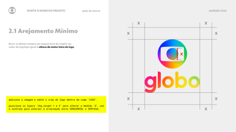

### modo de uso
abra a **comp** '_LOGO_',\
adicione a imagem do logo principal,\
ajuste o seu crop movendo os **layers** '_shp_target S_', '_shp_target E_', '_shp_target D_', '_shp_target I_'.

retorne para a tela '_Arejamento Mínimo_',\
mova os **layers** '_shp_target 1_', '_shp_target 2_' para ajustar a medida X,\
use o controle nos efeitos do **layer** '_shp_target 1_' para alternar a orientação sua orientação.

### controles
> 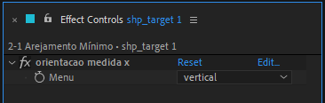

- orientacao medida x:

  - vertical → torna a medida X vertical.
  - horizontal → torna a medida X horizontal.

---

  

### 📍 Redução Mínima em Tela

> 🎬 _preview:_\
> 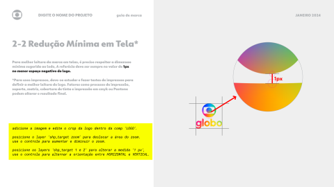

### modo de uso
abra a **comp** '_LOGO_',\
adicione a imagem do logo principal,\
ajuste o seu crop movendo os **layers** '_shp_target S_', '_shp_target E_', '_shp_target D_', '_shp_target I_'.

retorne para a tela '_Redução Mínima em Tela_',\
mova o **layer** '_shp_target zoom_' para deslocar a área do zoom.\
use o controle nos efeitos do **layer** '_shp_target zoom_' para alterar o zoom.

mova os **layers** '_shp_target 1_', '_shp_target 2_' para ajustar a medida 1px,\
use o controle nos efeitos do **layer** '_shp_target 1_' para alternar a orientação sua orientação.

### controles
> 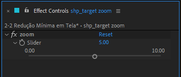

- zoom → aumenta e reduz a ampliação da área selecionada.

> 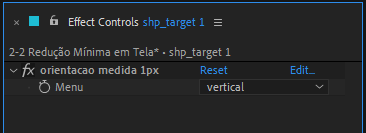

- orientacao medida 1px:

  - vertical → torna a medida X vertical.
  - horizontal → torna a medida X horizontal.

---

  

### 📍 Usos Incorretos

> 🎬 _preview:_\
> 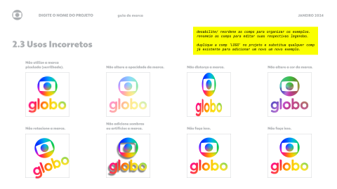

### modo de uso
desabilite / reordene os layers dos exemplos,\
renomeie os mesmos para editar as respectivas legendas.

para adicionar um novo exemplo:
  1. duplique a **comp** '_LOGO_' no projeto.
  2. nomeie a copia com a descrição do exemplo.
  3. substitua qualquer exemplo pela copia.
  4. reordene o layer da copia para a posição desejada.
  5. abra a **comp** da copia e edite o seu conteúdo.

> não existem controles nesta tela.

> 🚩 _obs:_
> - digite '_' no nome do exemplo para adicionar uma quebra de linha.

---

  

### 📍 Cores

> 🎬 _preview:_\
> 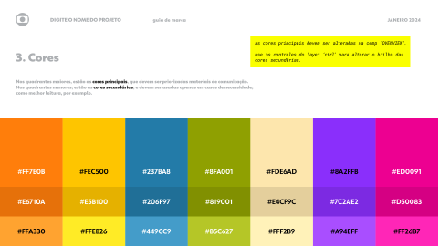

### modo de uso
as cores principais são controladas nos efeitos do **layer** '_shp_paleta principal_' na **comp** '_OVERVIEW_'.\
use os controles nos efeitos do **layer** '_ctrl_' para alterar o brilho das cores secundárias.

### controles
> 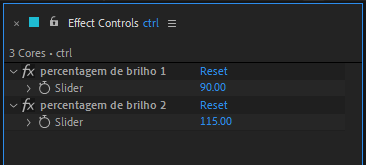

- percentagem de brilho 1 → aumenta e reduz o brilho do primeiro grupo de cores secundárias.
- percentagem de brilho 2 → aumenta e reduz o brilho do segundo grupo de cores secundárias.

---

  

### 📍 Tipografia Logo

> 🎬 _preview:_\
> 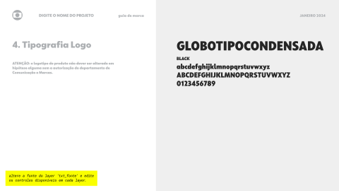

### modo de uso
altere a fonte do **layer** '_txt_fonte_'.
use o controle nos efeitos para habilitar a edição do nome da fonte.
use os controles nos efeitos do **layer** '_txt_peso_' para habilitar a edição do nome do peso\
e os elementos do texto de amostra.

### controles
> 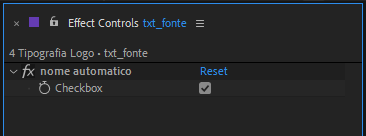

- nome automatico → habilita a edição do nome da fonte.

> 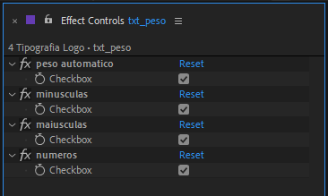

- peso automatico → habilita a edição do nome do peso da fonte.
- minusculas → habilita a exibição da letras minúsculas no texto de amostra.
- maiusculas → habilita a exibição da letras maiúsculas no texto de amostra.
- numeros → habilita a exibição dos números no texto de amostra.

---

  

### 📍 Tipografia Auxiliar

> 🎬 _preview:_\
> 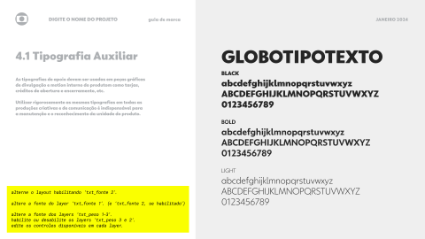

### modo de uso

---

  

### 📍 Assets de Apoio

> 🎬 _preview:_\
> 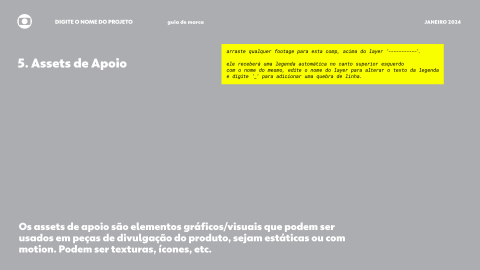

### modo de uso

---

  

### 📍 Key Visuals

> 🎬 _preview:_\
> _kv intro_\
> 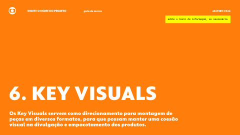

> _kv exemplos_\
> 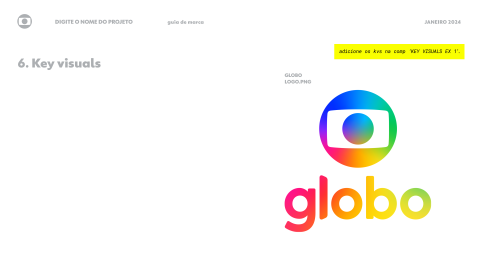

### modo de uso

---

  

### 📍 Links

> 🎬 _preview:_\
> 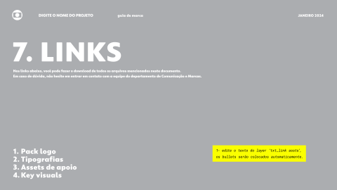

### modo de uso

