# 📓 TEMPLATES DO GUIA DE MARCA

> 📑 ***guia de marca - template vb2.aet***

---

  

> 🎬 *preview:*\
> 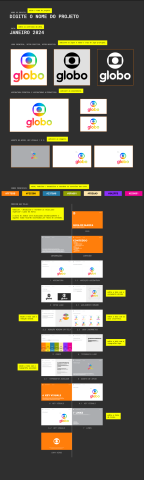

## 📍 funcionamento básico

na **comp** '*OVERVIEW*':

1. edite o nome e a data do projeto.
2. adicione as logos e assinaturas nas respectivas comps.
3. altere as cores da paleta.

e em suas respectivas telas:

4. ajuste o arejamento mínimo.
5. ajuste a redução mínima.
6. edite os exemplos de uso incorreto.
7. ajuste o brilho das cores secundárias.
8. selecione as tipografias do logo e auxiliares.
9. adicione os assets de apoio.
10. adicione os kvs.
11. edite a lista de links.

### controles
>
> 

- **mes**:
  - janeiro
  - fevereiro
  - março
  - abril
  - maio
  - junho
  - julho
  - agosto
  - setembro
  - outubro
  - novembro
  - dezembro
- **ano**:
  - 2022
  - 2023
  - 2024
  - 2025
  - 2026

> 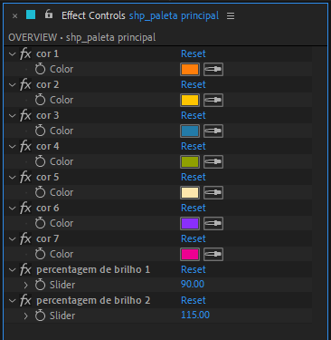

- cor 1 - 7 → controlam as cores da paleta principal.
- percentagem de brilho 1 → controla o brilho do primeiro grupo de cores secundárias.
- percentagem de brilho 2 → controla o brilho do segundo grupo de cores secundárias.

> 🚩 *obs:*\
> • habilite / desabilite e reordene as telas para organizar o guia da marca.\
> • habilite / desabilite e reordene os controles de cor para montar a paleta.\
> • o template irá suportar até 10 cores.\
> • a primeira cor é sempre a cor principal e será usada nos BGs.\
> • o preview das telas é dinâmico, a ordem da paginação e índice serão atualizados automaticamente.

---

  

## 🚨 Atenção!

- a cor principal será sempre a primeira cor da paleta.
- algumas telas só serão exibidas no preview caso tenham algum conteúdo.
- para adicionar uma nova tela:
  1. duplique o layer de uma tela existente.
  2. substitua a tela duplicada pela nova.
  3. reordene o layer da tela para a posição desejada.

---

  

## 📑 Templates de tela disponíveis

- Capa (frente e verso)
- Informações
- Conteúdo
- Assinatura
- Variação Assinatura (1 e 2 variações)
- Vetor Logo
- Arejamento Mínimo
- Redução Mínima em Tela
- Usos Incorretos (até 8 exemplos)
- Cores (até 10 cores principais)
- Tipografia Logo
- Tipografia Auxiliar (1 e 2 fontes)
- Assets de Apoio
- Key Visuals (intro e exemplos)
- Links

> 🚩 *obs:*\
> • algumas telas irão variar de layout dependendo do conteúdo a ser exibido.

---

  

### 📍 Capa

> 🎬 *preview:*\
> *capa frente*\
> 

> *capa verso*\
> 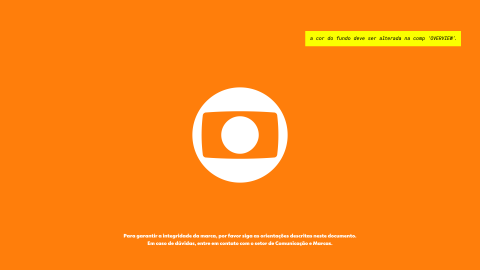

### modo de uso

a cor do fundo é controlada pela primeira cor da paleta na **comp** '*OVERVIEW*'.

*capa frente*\
o nome do projeto e a data devem ser editados na **comp** '*OVERVIEW*'.\

*capa verso*\
edite o texto do **layer** '*txt_info*', se necessário.

> não existem controles nestas telas.

---

  

### 📍 Informações

> 🎬 *preview:*\
> 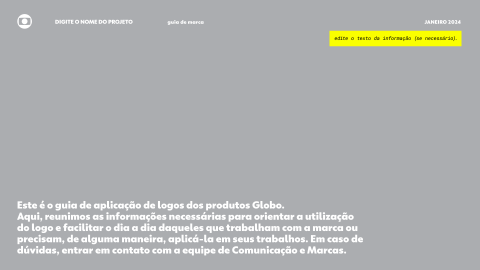

### modo de uso

edite o texto do **layer** '*txt_info*', se necessário.

> não existem controles nesta tela.

---

  

### 📍 Conteúdo

> 🎬 *preview:*\
> 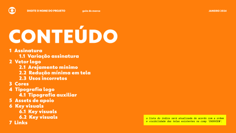

### modo de uso

a lista do índice é controlada pela ordem e visibilidade das telas na **comp** '*OVERVIEW*'.

> não existem controles nesta tela.

---

  

### 📍 Assinatura

> 🎬 *preview:*\
> 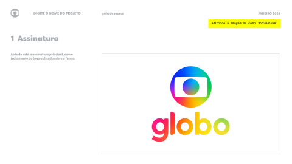

### modo de uso

abra a **comp** '*ASSINATURA*'.\
adicione a imagem da assinatura principal.

retorne para a tela '*Assinatura*'.
edite o texto do **layer** '*txt_info*', se necessário.

> não existem controles nesta tela.

> 🚩 *obs:*\
> • o preview desta tela na **comp** '*OVERVIEW*' é desabilitado caso não exista uma imagem na **comp** '*ASSINATURA*'.

---

  

### 📍 Variação Assinatura

> 🎬 *preview:*\
> *1 variação*\
> 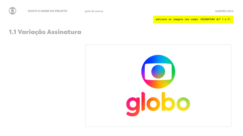

> *2 variações*\
> 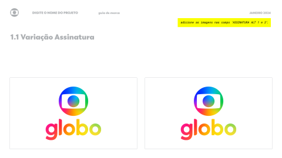

### modo de uso

abra as **comps** '*ASSINATURA ALT 1*' e '*ASSINATURA ALT 2*'.\
adicione as imagens das assinaturas alternativas nas respectivas comps.

retorne para a tela '*Variação Assinatura*'.

> não existem controles nestas telas.

> 🚩 *obs:*\
> • o layout também se adaptara ao habilitar / desabilitar os **layers** '*ASSINATURA ALT 1*' e '*ASSINATURA ALT 2*'.\
> • o preview desta tela na **comp** '*OVERVIEW*' é desabilitado caso não exista uma imagem nas **comps** '*ASSINATURA ALT 1*' e '*ASSINATURA ALT 2*'.

---

  

### 📍 Vetor Logo

> 🎬 *preview:*\
> 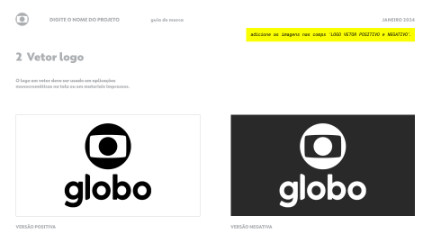

### modo de uso

abra a **comp** '*LOGO*'.\
adicione a imagem do logo principal.\
ajuste o seu crop movendo os **layers** '*shp_target S*', '*shp_target E*', '*shp_target D*', '*shp_target I*'.\

retorne para a tela '*Vetor Logo*'.\
edite o texto do **layer** '*txt_info*', se necessário.

> não existem controles nesta tela.

> 🚩 *obs:*\
> • as versões positiva e negativa são geradas automaticamente quando uma imagem é adicionada na **comp** '*LOGO*',\
> para sobrescrever as versões automáticas adicione uma imagem nas **comps** '*LOGO VETOR POSITIVO*' e '*LOGO VETOR NEGATIVO*'.\
> • o preview desta tela na **comp** '*OVERVIEW*' é desabilitado caso não exista uma imagem na **comp** '*LOGO*'.
---

  

### 📍 Arejamento Mínimo

> 🎬 *preview:*\
> 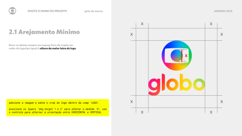\
> *alterado na versão b2*

### modo de uso

abra a **comp** '*LOGO*'.\
adicione a imagem do logo principal.\
ajuste o seu crop movendo os **layers** '*shp_target S*', '*shp_target E*', '*shp_target D*', '*shp_target I*'.

retorne para a tela '*Arejamento Mínimo*'.\
mova os **layers** '*shp_target 1*', '*shp_target 2*' para ajustar a medida X.\
use o controle nos efeitos do **layer** '*shp_target 1*' para alterar a orientação e cor.

edite o texto do **layer** '*txt_info*', se necessário.

### controles

> 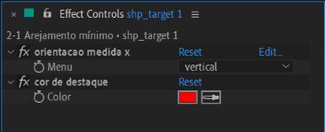\
*alterado na versão b2*

- **orientacao medida x**:
  - vertical → torna a medida X vertical.
  - horizontal → torna a medida X horizontal.
- **cor de destaque** → controla da medida X.

> 🚩 *obs:*\
> • o preview desta tela na **comp** '*OVERVIEW*' é desabilitado caso não exista uma imagem na **comp** '*LOGO*'.

---

  

### 📍 Redução Mínima em Tela

> 🎬 *preview:*\
> 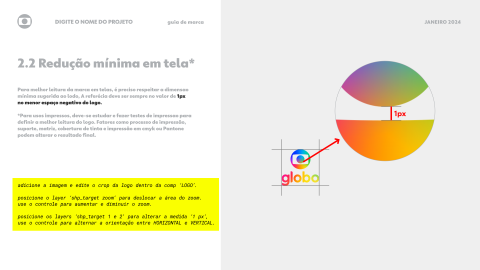\
> *alterado na versão b2*

### modo de uso

abra a **comp** '*LOGO*'.\
adicione a imagem do logo principal.\
ajuste o seu crop movendo os **layers** '*shp_target S*', '*shp_target E*', '*shp_target D*', '*shp_target I*'.

retorne para a tela '*Redução Mínima em Tela*'.\
mova o **layer** '*shp_target zoom*' para deslocar a área do zoom.\
use o controle nos efeitos do **layer** '*shp_target zoom*' para alterar o zoom.

mova os **layers** '*shp_target 1*', '*shp_target 2*' para ajustar a medida 1px.\
use o controle nos efeitos do **layer** '*shp_target 1*' para alterar a orientação e cor.

edite o texto do **layer** '*txt_info*', se necessário.

### controles

> 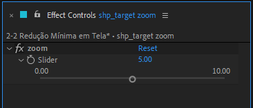

- **zoom** → aumenta e reduz a ampliação da área selecionada.

> 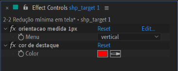\
> *alterado na versão b2*

- **orientacao medida 1px**:

  - **vertical** → torna a medida X vertical.
  - **horizontal** → torna a medida X horizontal.

- cor de destaque → controla da medida 1px e a seta indicativa.

> 🚩 *obs:*\
> • o preview desta tela na **comp** '*OVERVIEW*' é desabilitado caso não exista uma imagem na **comp** '*LOGO*'.
---

  

### 📍 Usos Incorretos

> 🎬 *preview:*\
> 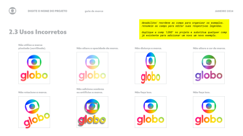

### modo de uso

desabilite / reordene os layers dos exemplos.\
renomeie os mesmos para editar as respectivas legendas.

para adicionar um novo exemplo:

  1. duplique a **comp** '*LOGO*' no projeto.
  2. nomeie a copia com a descrição do exemplo.
  3. substitua qualquer exemplo pela copia.
  4. reordene o layer da copia para a posição desejada.
  5. abra a **comp** da copia e edite o seu conteúdo.

> não existem controles nesta tela.

> 🚩 *obs:*\
> • digite '_' no nome do exemplo para adicionar uma quebra de linha.\
> • o preview desta tela na **comp** '*OVERVIEW*' é desabilitado caso não exista uma imagem na **comp** '*LOGO*'.

---

  

### 📍 Cores

> 🎬 *preview:*\
> 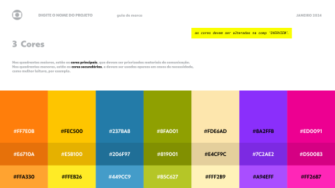

### modo de uso

edite o texto do **layer** '*txt_info*', se necessário.

todas as cores são controladas nos efeitos do **layer** '*shp_paleta principal*' na **comp** '*OVERVIEW*'.

> não existem controles nesta tela.

> 🚩 *obs:*\
> • a primeira cor é sempre a cor principal e será usada nos BGs.
---

  

### 📍 Tipografia Logo

> 🎬 *preview:*\
> 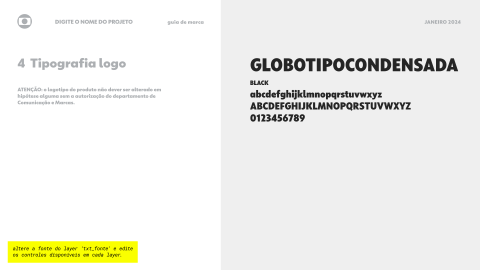

### modo de uso

altere a fonte do **layer** '*txt_fonte*'.\
use o controle nos efeitos para habilitar a edição do nome da fonte.\
use os controles nos efeitos do **layer** '*txt_peso*' para habilitar a edição do nome do peso\
e os elementos do texto de amostra.

edite o texto do **layer** '*txt_info*', se necessário.

### controles

> 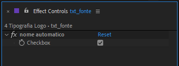

- **nome automatico** → habilita a edição do nome da fonte.

> 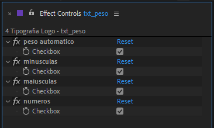

- **peso automatico** → habilita a edição do nome do peso da fonte.
- **minusculas** → habilita a exibição da letras minúsculas no texto de amostra.
- **maiusculas** → habilita a exibição da letras maiúsculas no texto de amostra.
- **numeros** → habilita a exibição dos números no texto de amostra.

---

 

### 📍 Tipografia Auxiliar

> 🎬 *preview:*\
> *1 fonte*\
> 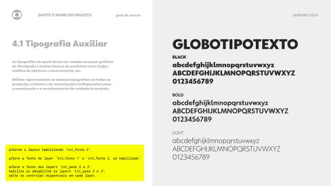

> *2 fontes*\
> 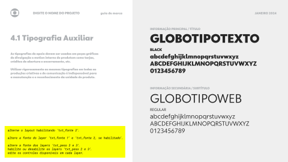

### modo de uso

alterne o layout habilitando o **layer** '*txt_fonte 2*'.

altere as fontes dos **layer** '*txt_fonte 1*' e '*txt_fonte 2*', se habilitado.\
use o controle nos efeitos para habilitar a edição dos nomes das fontes.

altere as fontes dos **layer** '*txt_peso 2*' e '*txt_peso 3*', se habilitados.\
use o controle nos efeitos para habilitar a edição dos nomes dos pesos\
e os elementos do texto de amostra.

edite o texto do **layer** '*txt_info*', se necessário.

### controles

> \
> 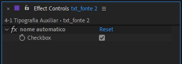

- **nome automatico** → habilita a edição do nome da fonte.

> 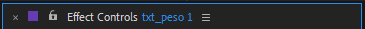\
> 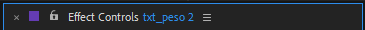\
> 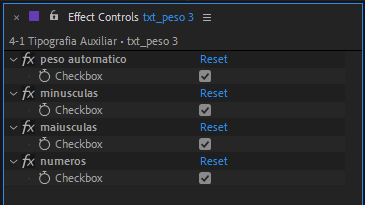\

- **peso automatico** → habilita a edição do nome do peso da fonte.
- **minusculas** → habilita a exibição da letras minúsculas no texto de amostra.
- **maiusculas** → habilita a exibição da letras maiúsculas no texto de amostra.
- **numeros** → habilita a exibição dos números no texto de amostra.

---

 

### 📍 Assets de Apoio

> 🎬 *preview:*\
> 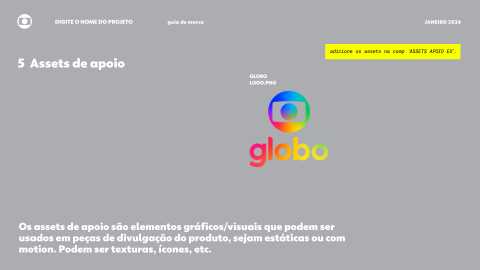

### modo de uso

abra a **comp** '*ASSETS APOIO EX*'.\
adicione as imagens.\
renomeie as mesmas para editar as respectivas legendas.

retorne para a tela '*Assets de Apoio*'.\
edite o texto do **layer** '*txt_info*', se necessário.

> não existem controles nesta tela.

> 🚩 *obs:*\
> • digite '_' no nome das imagens para adicionar uma quebra de linha.\
> • o preview desta tela na **comp** '*OVERVIEW*' é desabilitado caso não existam imagens na **comp** '*ASSETS APOIO EX*'.

---

 

### 📍 Key Visuals

> 🎬 *preview:*\
> *kv intro*\
> 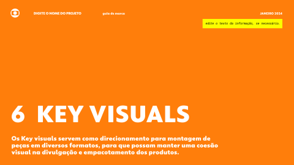

> *kv exemplos*\
> 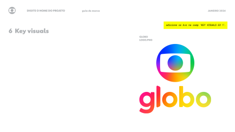

### modo de uso

*kv intro*\
edite o texto do **layer** '*txt_info*', se necessário.

*kv exemplos*\
abra a **comp** '*KEY VISUALS EX*'.\
adicione as imagens.\
renomeie as mesmas para editar as respectivas legendas.

retorne para a tela '*KEY VISUALS*'.

> não existem controles nesta tela.

> 🚩 *obs:*\
> • digite '_' no nome das imagens para adicionar uma quebra de linha.\
> • o preview destas telas na **comp** '*OVERVIEW*' é desabilitado caso não existam imagens na **comp** '*KEY VISUALS EX*'.

---

 

### 📍 Links

> 🎬 *preview:*\
> 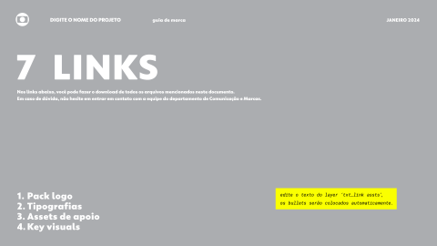

### modo de uso

edite o texto do **layer** '*txt_link assets*'.\
edite o texto do **layer** '*txt_info*', se necessário.

> não existem controles nesta tela.
