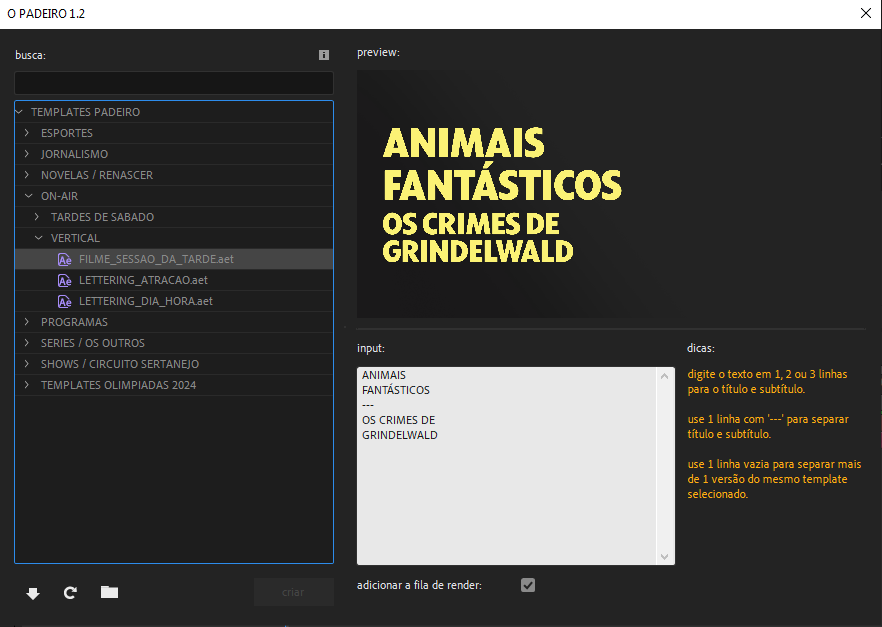
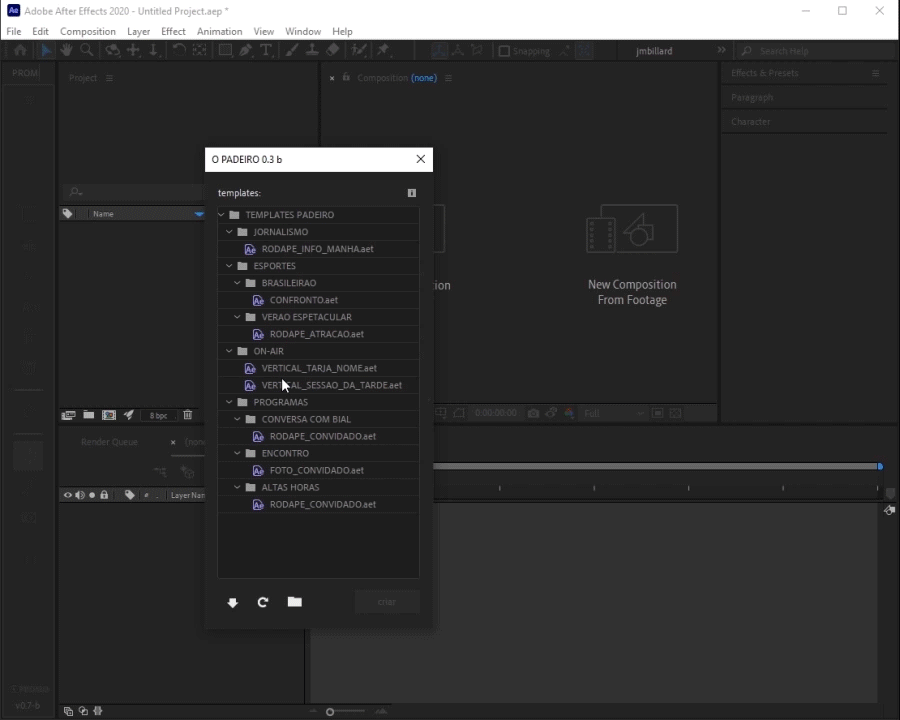
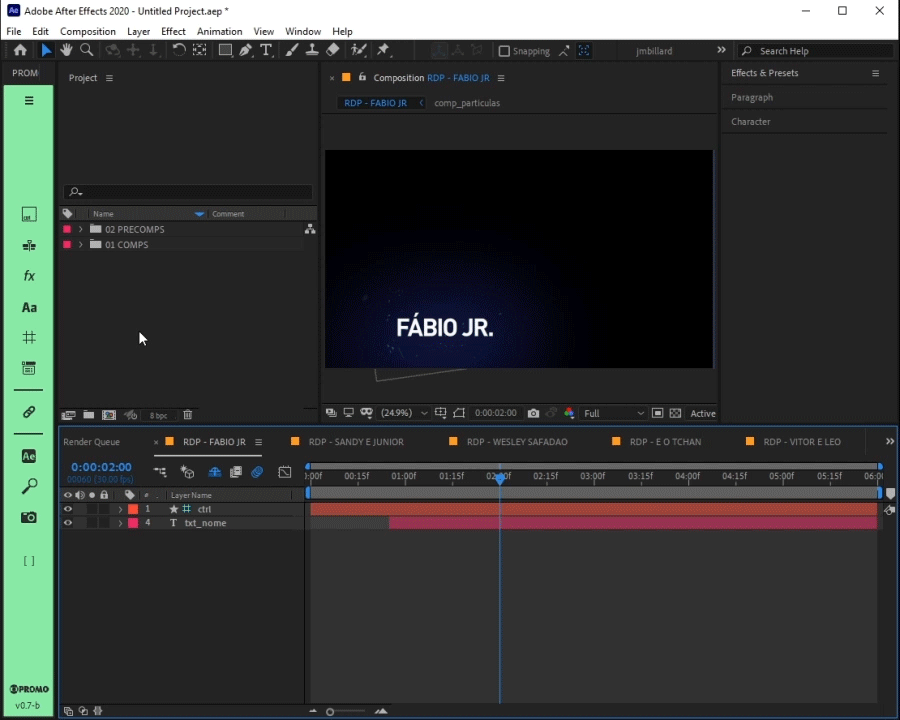
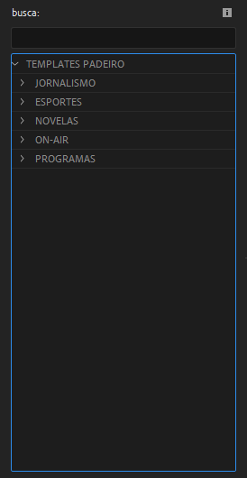
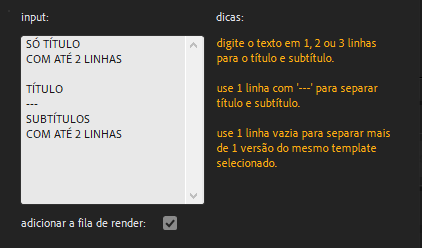
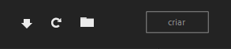

# O PADEIRO *script*

**pt-BR** ⚡ Ferramenta de preenchimento em massa de templates no After Effects ⚡

> 📂 **pastas:**\
> • **templates** → *\\\\vfx-ml-sp.servicos.corp.tvglobo.com.br\VFX\imagem\drive_l\Fileserver_3\INSTITUCIONAL\\_adm-designers\TEMPLATES\TEMPLATES PADEIRO*\
>
> • **script** → *\\\\vfx-ml-sp.servicos.corp.tvglobo.com.br\VFX\imagem\drive_l\Fileserver_3\INSTITUCIONAL\\_adm-designers\SCRIPTS FREE\O_PADEIRO*

> 📑 **O PADEIRO.jsx**

<br/>

## 📟 Interface



## 📌 funcionamento básico

após executar o script '**O PADEIRO.jsx**':

1. selecione o template desejado da lista '**templates**'.
2. preencha o campo '**input**' seguindo as '**dicas**'.
3. habilite ou não a opção '**adicionar a fila de render**'.
4. clique no botão '**criar**'.
5. caso tenha habilitado '**adicionar a fila de render**', selecione um preset para o render output.

<br/>

o script executará as seguintes tarefas em ordem:

1. importar os arquivos do projeto.
2. duplicar as comps necessárias.
3. preencher as informações inseridas no input.
4. renomear as comps com base no seu conteúdo.
5. organizar o projeto seguindo o padrão da PROMO.
6. se habilitado, adicionar as comps criadas a fila de render
7. setar os caminhos para o output.

> 📋 *exemplo de uso:*\
> \
> \
> 

### templates



- **lista de templates** → árvore com todos os templates disponíveis na pasta de templates do script.
- **ajuda | DOCS** → acessa a documentação completa do script e seus templates disponíveis.

> 🚩\
> • ao selecionar um template da lista, a interface do script se ajustará para exibir um preview, o campo de input e dicas, se disponíveis.\
> • apenas os templates podem ser selecionados na lista.\
> • apenas os arquivos com extensão '*.aep*', '*.aet*' e seus diretórios são exibidos na lista.\

### preview


- **imagem de preview** → exibe uma imagem de exemplo do template selecionado.

> 🚩\
> • caso não exista uma imagem de preview, será exibido um aviso "PREVIEW NÃO DISPONÍVEL".

### input



- **texto** → campo de texto editável multifuncional, é o responsável pelo preenchimento de qualquer possível campo de texto do template selecionado.
- **adicionar a fila de render** → se habilitado, adiciona as comps criadas e o seus caminhos corretos no output automaticamente.
- **dicas** → tópicos curtos explicando o preenchimento do template selecionado.

> 📋 *exemplo de arquivo de configuração:* *"RODAPE CONVIDADO_config.json"*
>
> ```json
> // "\n" representa uma quebra de linha. :)
> {
>  "configName": "CONVERSA COM BIAL TARJA RODAPÉ CONVIDADO", // → nome da configuração.
>  "exemple": "NOME CURTO\n\nNOME MAIOR\nCOM SOBRENOME\n\nNOME MAIOR\nCOM SOBRENOME\n---\nINFORMAÇÃO", // → texto de exemplo do input.
>  "tip": "digite o texto em 1, 2 ou 3 linhas para nome e informação.\n\nuse 1 linha com '---' para separar nome e informação.\n\nuse 1 linha vazia para separar mais de 1 versão do mesmo template selecionado.\n\nuse os controles nos efeitos do layer 'ctrl'.", // → texto com as dicas de preenchimento.
>
>  "compName": "RDP - CONVIDADO TEMPLATE", // → nome da comp a ser editada.
>  "prefix": "RDP", // → prefixo que o nome da comp editada receberá.
>  "refTime": 2, // → tempo, em segundos, do momento em que todas as infos preenchidas estão visíveis na comp.
>  "separator": "---", // → texto usado para separar as informações de tipos diferentes.
>  "textCase": "upperCASE", // → o tipo de caixa de texto que o template deve receber: "upperCASE", "lowerCase" ou "titleCase".
>  "inputLayers": [ // → lista com os layers editáveis da comp.
>   {"layerIndex": 4, "method": "textContent"}, // → índice do layer: 1, 2, 3, etc.
>   {"layerIndex": 5, "method": "textContent"} // → método: "layerName" renomeia o layer ou "textContent" preenche o conteúdo de um layer de texto.
>  ],
>
>  "outputPath": "//10.193.48.13/promo_ber/BACKUP/artes/ARTES PARA EDICAO/CONVERSA COM BIAL/CONVIDADOS", // → caminho padrão do output.
>  "alpha": true  // → aviso que o canal alpha é necessário.
> }
> ```

> 🚩\
> • o '**input**' é pré preenchido com dados genéricos disponíveis no arquivo de configuração do template selecionado apenas para exemplificar **ALGUMAS** possibilidades de preenchimento.\
> • sem um arquivo de configuração, não é possível preencher o template selecionado usando a janela de texto do '**input**'.\
> • você ainda poderá **IMPORTAR** e **PREENCHER MANUALMENTE** o template no After Effects!!!

### botões



- **importar** → importa o arquivo '*.aet*' ou '*.aep*' do template selecionado para o projeto.
- **atualizar lista** → verifica e atualiza a lista de templates disponíveis.
- **abrir pasta** → abre a pasta raiz de templates.
- **criar** → inicia a execução do preenchimento automático.

### render setup


- **templates de render** → caso tenha habilitado '**adicionar a fila de render**', selecione um preset para o render output.

> 🚩\
> • o export padrão é um arquivo '*.mov*' em '*QUICKTIME PRORES 422*' para artes sem alpha ou '*444 RGB+A*' (com alpha **STRAIGHT**).\

---

<br/>

## 🚨 Atenção!

`CONFIRA SEMPRE AS COMPOSIÇÕES CRIADAS, SEU CONTEÚDO E O CAMINHO DO OUTPUT!`

os layouts dos templates podem variar para exibir ou omitir diferentes tipos de informação, assim, é possível que o resultado final fique diferente do preview.
> 📋 *exemplo:*\
> as comps criadas podem ter layers omitidos por falta de conteúdo inserido ou elementos com cores diferentes das exibidas no preview.

idealmente cada template deve possuir uma imagem com o mesmo **nome exato** do template seguida de '*_preview.png*' e um arquivo de configuração '*_config.json*' com as informações necessárias para o preenchimento correto do template selecionado.
> 📋 *exemplo:*\
> um template chamado *"FOTO_CONVIDADO.aet"* deve estar acompanhado por uma imagem de preview *"FOTO_CONVIDADO_preview.png"* e um arquivo de configuração *"FOTO_CONVIDADO_config.json"*.

o script possui padrões internos caso não seja especificado um caminho de output ou a pasta de destino não exista, o mesmo ocorre para o texto separador de informações diferentes.

> 📋 *padrões internos:*\
> • **caminho do output padrão** → '*\Desktop*'.\
> • **separador de informação padrão** → '*---*'.

é possível usar a quebra de linha '*\n*' como separador no arquivo de configuração. muito útil para separar a mesma informação em layers de texto com formatação distintas.

> 📋 *exemplo:*\
> um input com o nome *"Lima\nDuarte"*, em duas linhas, com o primeiro nome *"Lima"* em uma fonte light e o sobrenome "Duarte" em uma fonte bold.

---

<br/>

## 🧾 templates disponíveis (work in progress)

---

<br/>

## ✨ dicas

não é preciso se preocupar com a caixa do texto, o script e/ou o próprio template são responsáveis pela conversão do texto de letras minúsculas para maiúsculas e vice-versa.

> 📋 *exemplo:*\
> os input "*cauã raymond*", "*CAUà RAYMOND*" ou "*cAuà raYMOnd*" serão exibidos como "*Cauã Raymond*" em um template que usa '*titleCase*' no arquivo de configuração.

é possível importar rapidamente qualquer template da lista executando um clique duplo no mesmo.

para agilizar a execução do script use o botão **o padeiro** na barra de **PROMO v0.7b** ou superior.

> 📋 *exemplo:*\
> 
