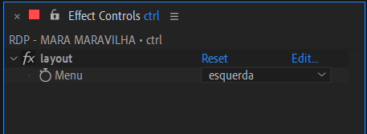

# 📓 ALTAS HORAS RODAPÉ CONVIDADO

> 📑 *projeto:* ***RODAPE_CONVIDADO.aet***\
> 📂 *export:* caminho do export aqui

---

 

> 🎬 *preview:*\
> 

---

 

## 📍 funcionamento básico

1. abra a **comp** '*RDP - CONVIDADO TEMPLATE*'.
2. edite o texto do **layer** '*txt_nome*' com o nome do convidado.
3. selecione o **layer** '*ctrl*'.
5. use a *janela de controle de efeitos* para acessar os controles disponíveis.
5. renomeie a **comp** '*RDP - CONVIDADO TEMPLATE*' substituindo as palavras '*CONVIDADO TEMPLATE*' pelo nome do convidado.

> 📋 *exemplo:* "*RDP - E O TCHAN*".

> 🚩 *obs:* Sempre use **CAIXA ALTA SEM ACENTUAÇÃO** e **SEM CARACTERES ESPECIAIS** para nomear **comps**.

---

 

## 📍 parâmetros

todos os controles estão no **layer** '*ctrl*', são eles:

- **layout**:

  - **esquerda** → posiciona o texto no lado esquerdo.
  - **direita** → posiciona o texto no lado esquerdo.

---

 

## 🚨 Atenção!

aviso importante.

> 📋 *exemplo:*

> 🚩 *obs:*

---

 

## ✨ dicas

dica 1

> 📋 *exemplo:*\
> 

> 🚩 *obs:*

---

dica 2

> 📋 *exemplo:*\
> texto do exemplo.
