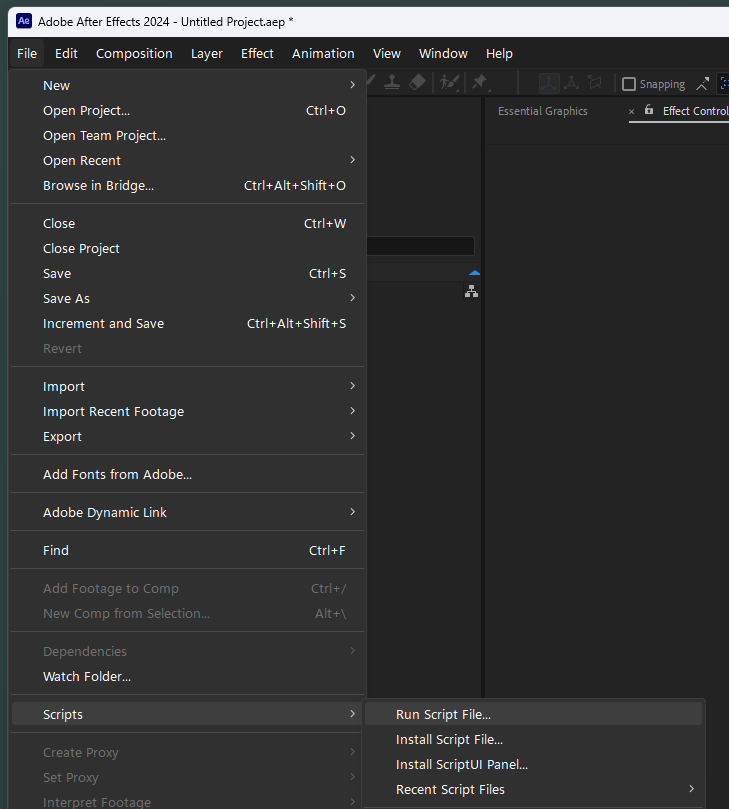
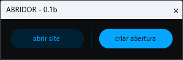
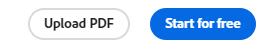
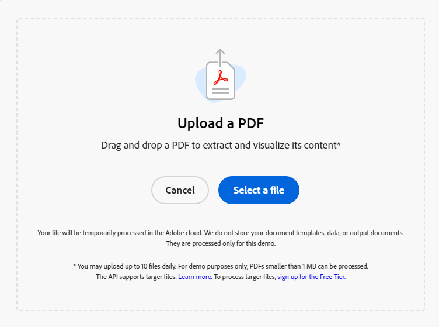
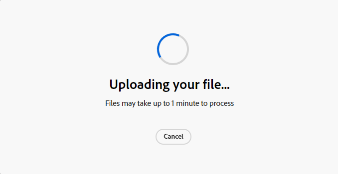
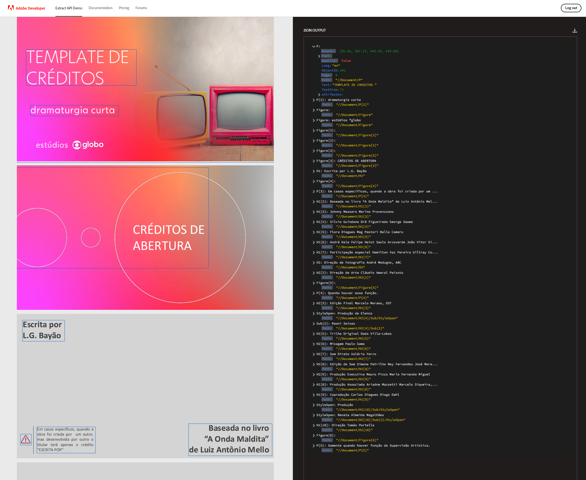
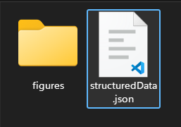
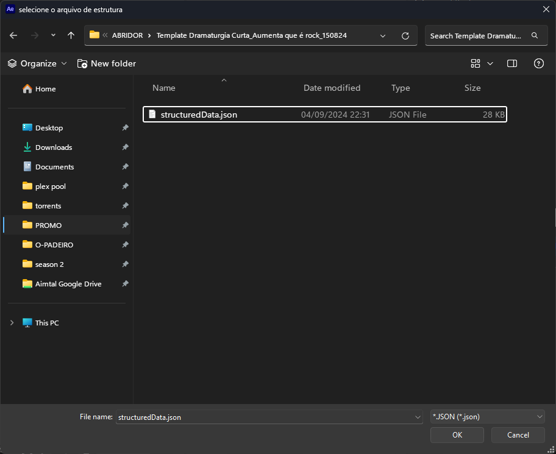

# 🧾 ABRIDOR *script*

🗨️ **pt-BR** ⚡ Ferramenta para agilizar a criação dos layouts de uma abertuta ⚡

O script cria o layout de uma abertura a partir de um arquivo de estrutura **JSON** contendo os textos dos créditos, posições aproximadas e alinhamentos.

> 📂 **arquivos:**\
> • **ABRIDOR 0.1b.jsxbin** → é o aquivo que deve ser executado no after effects.

 

---

 

## 📍 execução

execute o script pelo menu:\
`File` > `Scrips` > `Run Script File...`

> 📋 *exemplo:*
>
> 

após a execução do script a interface do '**ABRIDOR**' será exibida.

 

---

 

## 📍 a interface principal

essa versão da interface contem apenas 2 botões.

> 📟 v0.1b:
>
> 

botões em ordem:

- **abrir site**:\
`◖ clique esquerdo` → abre o site para extrair a estrutura do pdf.
  >

- **criar abertura**:\
`◖ clique esquerdo` → seleciona a pasta da produção atual.
  >

 

> 🚩 *obs:*\
> • essa é uma interface de teste sem muitas funcionalidades.

 

---

 

## 📍 preparação inicial

abra o **PPT** / **PPTX** e salve como um arquivo **PDF**.

> 🚩 *obs:*\
> • opcionalmente, exporte também os slides como **PNG** ou **JPG** para servir de referencia.

 

---

 

## 📍 extraindo a estrutura de um pdf

após abrir o site, clique no botão '*Upload PDF*' no rodapé da janela.

> 

crie uma conta particular ou faça login com sua conta pessoal, **NÃO É POSSÍVEL USAR A CONTA CORPORATIVA DA GLOBO**.\
em seguida, faça o upload do arquivo PDF com o layout da abertura.

> 

o PDF será processado por alguns minutos, aguarde.

> 

assim que o processamento for concluído, a estrutura será exibida na lateral da janela.

> 

clique no botão '**Download JSON**' no topo da janela do lado direito.

> 

um **zip** será salvo... extraia o arquivo **JSON** com a estrutura da abertura.

> 

clique no botão '**criar abertura**', selecione o arquivo de estrutura e clique em '**OK**'.

> 
> 

opcionalmente, selecione imagens de referencia exportadas na preparação inicial.

> 🚩 *obs:*\
> • desmarque a opção de importar como sequencia de imagens.\
> • um alerta será exibido caso a seleção de imagens de referência seja cancelada.

uma comp '**LAYOUT ABERTURA**' será criada com o layout aproximado do arquivo **PDF**.
